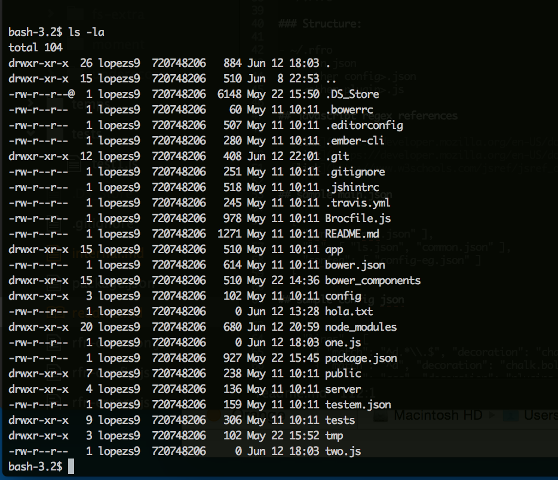
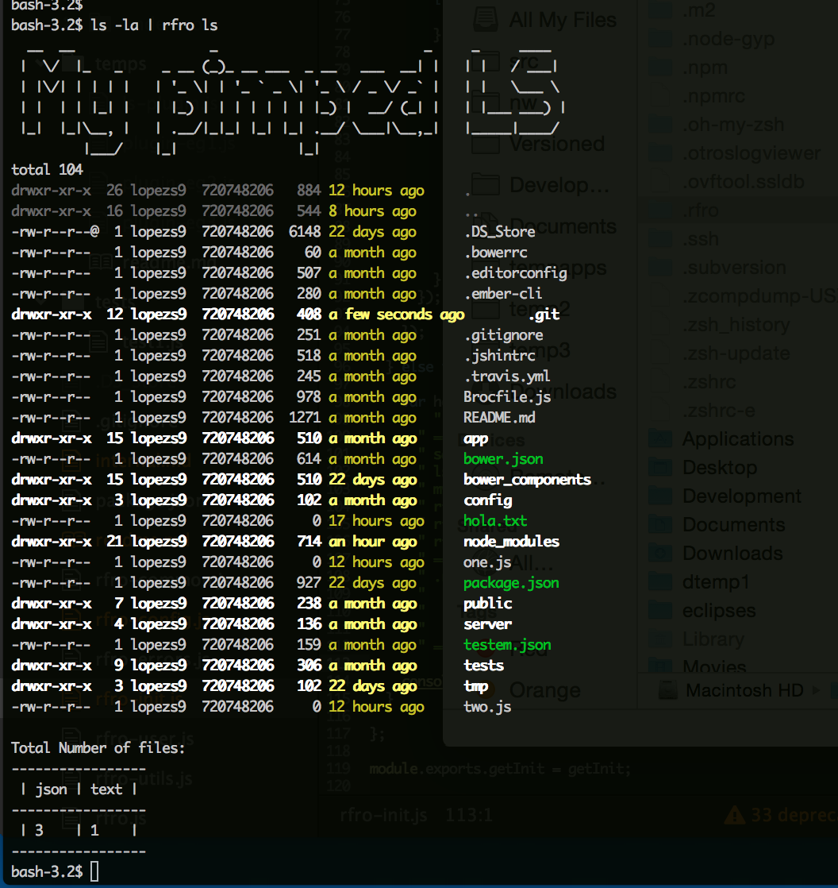

refracto
========

## refracto : refract your outputs!

## from this



## to this



## description

The project gets the pipe output from any command and processes the output before going on the screen, line by line. It uses configuration files to tell what keyword configuration file to use with what type of command. The most important configuration is the main.json file which has the keywords and corresponding json files. The other json files are the actual output descriptions and rules for any command output refraction. The project uses the [chalk](https://www.npmjs.com/package/chalk) project for coloring any string match. Plugins, other js files can also be included and they can have npm third party dependencies. These js (javascript) files are written in the node format, and if they have a start or finish function they will be called before and after the output starts, as shown in the ls.json and ls-plugin.js examples.

## installation

you need to have nodejs and npm installed

```
npm install -g refracto
```

## setup

to make the project's user folder:
```
rfro init
```

to install libraries if using plugins:
```
cd ~/.rfro
npm insall
```

## usage

to change mvn output:
```
<mvn command> | rfro mvn
```

to change ls output:
```
<ls command> | rfro ls
```

to reset the project's user folder to default state:
```
rfro reset
```

help:
```
rfro help
```

to change mvn output, with some rfro log debug help:
```
<mvn command> | rfro mvn debug
```

to change mvn output, with lots of verbose rfro logs:
```
<mvn command> | rfro mvn debug
```

## rfro user folder
```
~/.rfro
```

### rfro folder tructure:

- ~/.rfro
  - main.json
  - any-config.json
  - any-plugin.js

## javascript regex references

- [Mozilla 1](https://developer.mozilla.org/en-US/docs/Web/JavaScript/Reference/Global_Objects/RegExp)
- [Mozilla 2](https://developer.mozilla.org/en-US/docs/Web/JavaScript/Guide/Regular_Expressions)
- [W3 Schools](http://www.w3schools.com/jsref/jsref_obj_regexp.asp)

## sample main.json
```
  {
    "mvn": [ "mvn.json" ],
    "ls": [ "ls.json", "common.json" ],
    "confeg1": [ "config-eg1.json" ]
  }
```

## sample config json
```
  {
    "lines" : [
      { "match": "^d.*\\.$", "decoration": "chalk.grey" },
      { "match": "^d", "decoration": "chalk.bold" },
      { "match": "aaa", "decoration": "plugins.plugeg1.func1" }
    ],
    "blocks" : [
      { "match": "\\S*$", "decoration": "chalk.bold" }
    ],
    "plugins": {
      "plugeg1": "plugin-eg1.js"
    }
  }
```

## sample plugin js
```
  var moment = require("moment");
  module.exports = {
    iii: 0,
    start: function() {
      console.log('start = '+this.iii);
    },
    func1: function(data) {
      return '<<<<<'+ data +'>>>>>';
    },
    func2: function(data) {
      this.iii++;
      return '~~~~~~~~~~'+ data + '~~' + moment().format() + '~~~~~~~~~~~';
    },
    finish: function() {
      console.log('total rest = '+this.iii);
    }
  };
```

## libraries available for plugins

- chalk
- moment js
- underscore
- fliglet
- asciitable

**Because they are included in the original .rfro/package.json; however any other npm library can be included**

## caveats

- **The project is very young so it needs some code cleanup and there are probably bugs not found yet**
- **Because how the project is made there are some problems with the project**
- matching with ^ or $ (end or beginning of line) may or may not work only once, it works at least once
- string manipulation and replacement, try to match as close as possible to the match, using the javascript regex rules, if something is not working you can use the debug and the verbose help
